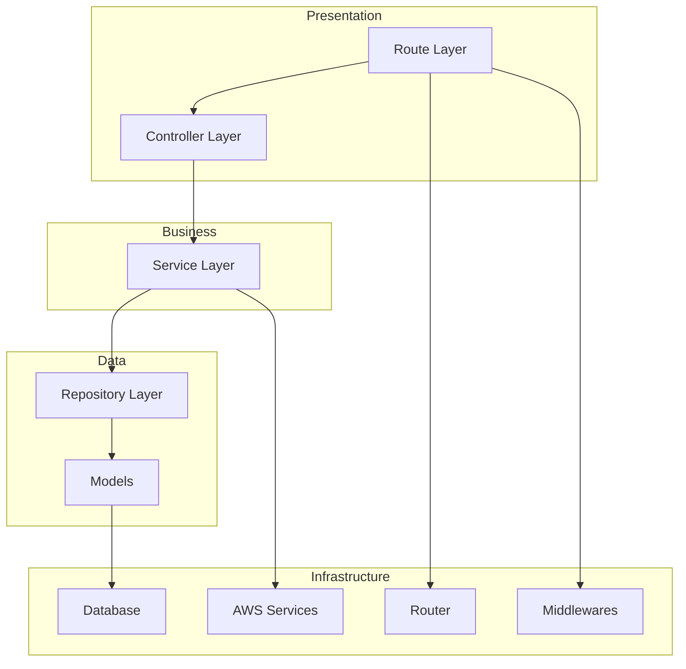
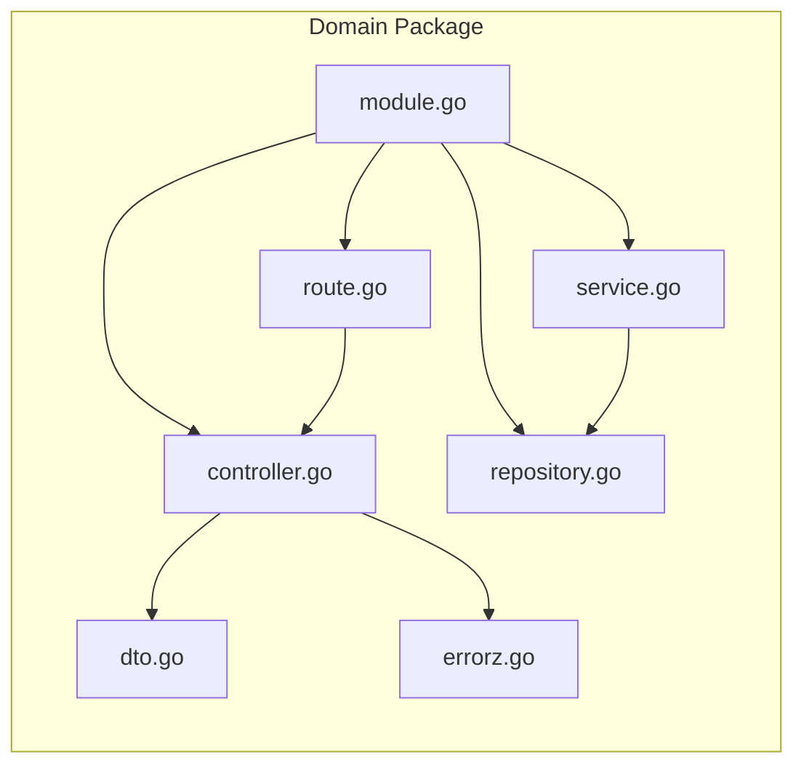
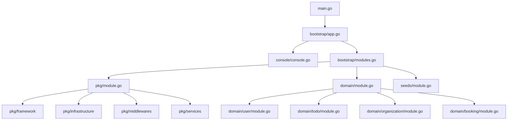
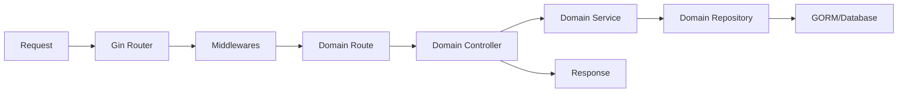
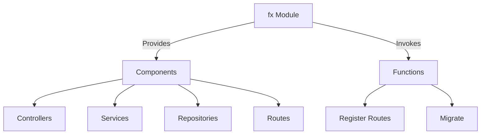

# System Patterns - Go Clean Architecture

## System Architecture
This application follows a clean architecture approach with clear separation of concerns:

## Domain-Driven Structure
Each domain (feature area) is organized with the same internal structure:

## Key Technical Decisions

### 1. Dependency Injection with uber-go/fx
- Used for managing dependencies throughout the application
- Modules are registered in the bootstrap/modules.go file
- Each domain has its own module.go to register dependencies

### 2. Command Structure with Cobra
- CLI commands structured with Cobra
- Main app:serve command for running the API server
- Shared application container for commands

### 3. Database Access with GORM
- GORM for database operations
- Repository pattern for data access
- Models with GORM annotations in domain/models
- Atlas for database migrations

### 4. HTTP Handling with Gin
- Gin Web Framework for HTTP routing
- Standardized response structures
- Middleware support for authentication, rate limiting, etc.

### 5. Environment Configuration
- Environment variables managed with Viper
- Central framework.Env structure
- .env file support with godotenv

### 6. Error Handling
- Custom error types with proper HTTP status codes
- Standardized error responses
- Error handling middleware with Sentry integration

## Component Relationships

### Application Bootstrap

### Request Flow

### Dependency Injection

The architecture follows a consistent pattern across all domains, making it scalable and maintainable. The dependency injection system ensures loose coupling between components.
